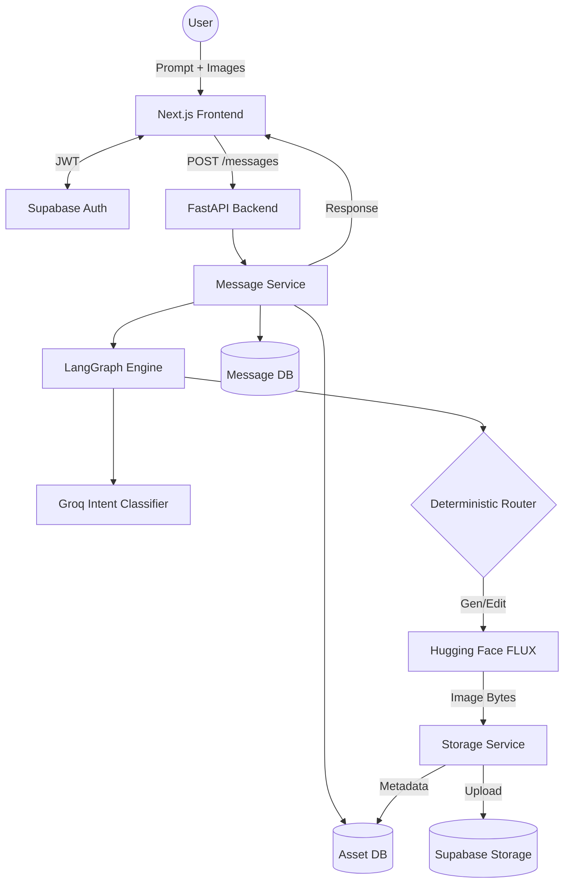
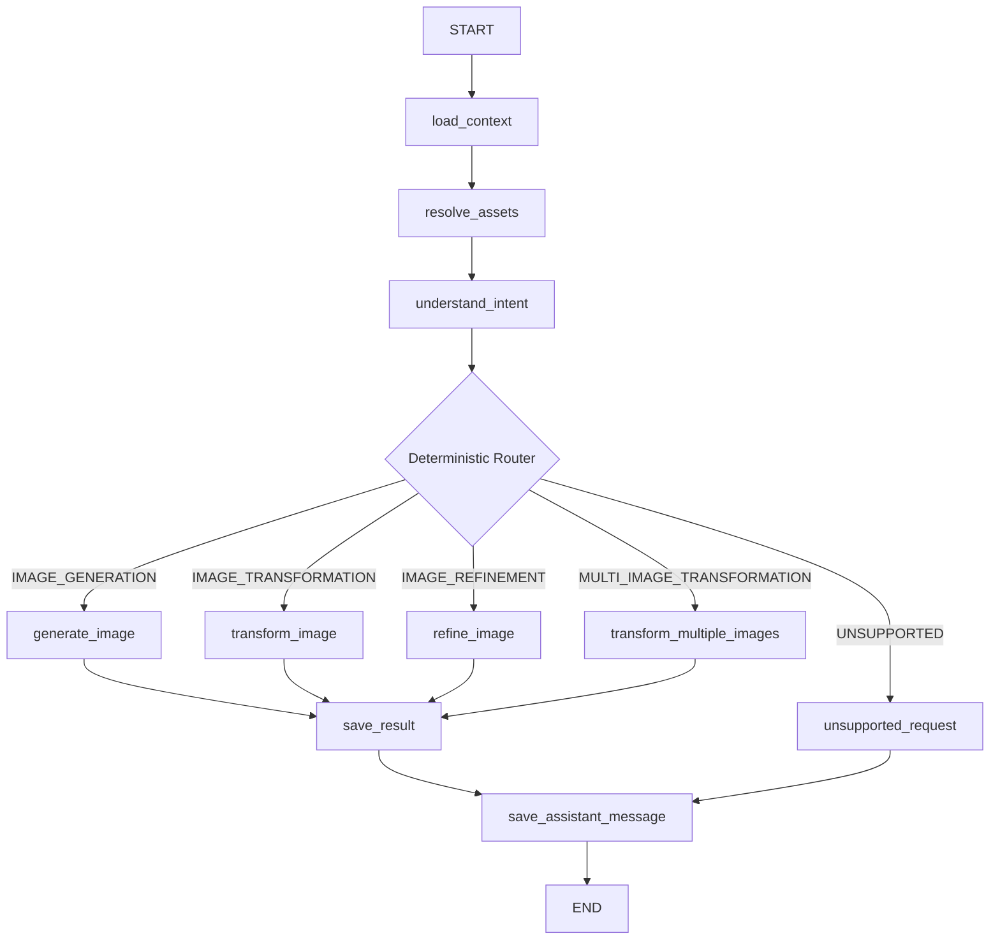
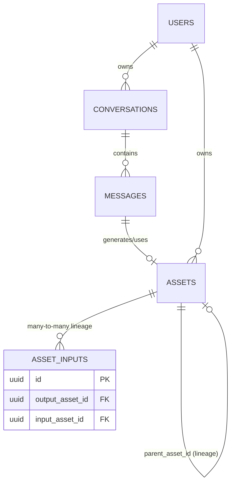

# Vizzy Chat

Vizzy is a conversational visual creation workspace. It rethinks the traditional image-generation workflow by turning a chat interface into an intelligent, stateful canvas. Users can generate, refine, and transform images entirely through natural language dialogue without the friction of manual downloads, uploads, or version management.

---

## 📖 Table of Contents
1. [Product Overview](#product-overview)
2. [Core Features](#core-features)
3. [System Architecture](#system-architecture)
4. [LangGraph Architecture](#langgraph-architecture)
5. [Intent Understanding & Deterministic Routing](#intent-understanding--deterministic-routing)
6. [AI Models & Providers](#ai-models--providers)
7. [Why This Stack?](#why-this-stack)
8. [API Reference](#api-reference)
9. [Database Design](#database-design)
10. [Storage & Security](#storage--security)
11. [Setup Instructions](#setup-instructions)
12. [Testing & CI](#testing--ci)
13. [Real Development Challenges](#real-development-challenges)
14. [Future Improvements & Limitations](#future-improvements--limitations)
15. [Interview Guide](#interview-guide)

---

## 🎯 Product Overview

### What is Vizzy?
Vizzy is an AI-powered conversational application that supports:
- **Text-to-Image Generation:** Generating new images from text prompts.
- **Image-to-Image Transformation:** Applying text instructions to user-uploaded images.
- **Conversational Refinement:** Iteratively modifying the *previous* AI-generated image in the chat simply by asking for changes (e.g., "make it darker").
- **Multi-image Transformation:** Compositing multiple uploaded images into a single transformation.

**What it is NOT:**
- Vizzy does *not* do video or voice generation.
- It does *not* have cross-conversation memory (memory is isolated per conversation).
- It does *not* use a complex, autonomous multi-agent swarm; instead, it relies on a deterministic state machine for predictability.

### The Problem it Solves
Traditional image generation tools force users into a repetitive loop: generate an image, download it, upload it as an img2img reference, tweak the prompt, and generate again. Managing versions becomes a manual nightmare. 

Vizzy solves this by maintaining a conversational context and a strict **Asset Lineage**. If you generate a "Polar bear in the Arctic" and then type "Add sunglasses", Vizzy automatically resolves the previous generated image as the input, streams it to the transformation model, and links the new output to its parent, creating a seamless iterative workflow.

---

## ✨ Core Features

- **Authentication:** Supabase Email/Password auth protecting all API routes and frontend pages.
- **Conversations:** Stateful chat sessions that automatically track user context and message history.
- **Asset Lineage:** The backend tracks `parent_asset_id` and `asset_inputs` in PostgreSQL, enabling infinite iteration trees without data loss.
- **Image Uploads:** Users can upload up to 5 images per message. The frontend uploads to Supabase Storage and passes the returned `asset_ids` to the backend.
- **Smart Provider Error Handling:** If the AI provider fails (e.g., HTTP 402 Out of Credits or HTTP 429 Rate Limited), the backend intercepts the failure and returns a human-readable assistant message rather than crashing the UI or creating fake assets.

---

## 🏗️ System Architecture



### Frontend Architecture
- **Next.js (App Router):** Manages routing (`/chat/[conversationId]`) and server/client component boundaries.
- **TypeScript & Tailwind:** Provides end-to-end type safety and rapid styling.
- **API Client:** A centralized `fetchWithAuth` wrapper parses FastAPI validation errors (422) and automatically handles JWT injection.
- **State Flow:** Optimistic message updates, loading states during LLM/Image processing, and native scrolling using Flexbox `min-h-0`.

### Backend Architecture
- **FastAPI:** Handles routing, HTTP validation via Pydantic, and JWT decoding.
- **Service Layer:** `MessageService` orchestrates the DB operations and invokes LangGraph.
- **AI Layer:** Isolated provider clients (`GroqProvider`, `HuggingFaceProvider`) and the LangGraph state machine.
- **Repository Layer:** Abstracted data access (`AssetRepository`, `MessageRepository`) cleanly interacting with Supabase via the PostgREST API.

---

## 🧠 LangGraph Architecture

Instead of autonomous agents, Vizzy uses **LangGraph** to create a highly predictable, debuggable state machine.



**Node Responsibilities:**
- `load_context`: Pulls conversation history.
- `resolve_assets`: Validates frontend-supplied `asset_ids` against DB ownership rules.
- `understand_intent`: Uses Groq to classify the natural language intent.
- `refine_image`: Implicitly queries the DB for the *latest* generated asset to use as a baseline, avoiding the need for re-uploads.
- `save_result`: Handles the heavy lifting of uploading bytes to Supabase Storage and writing lineage data to Postgres.

---

## 🔀 Intent Understanding & Deterministic Routing

**The Design Philosophy:** *LLMs should understand language; deterministic code should handle state.*

Vizzy classifies user prompts into five intents: `IMAGE_GENERATION`, `IMAGE_TRANSFORMATION`, `IMAGE_REFINEMENT`, `MULTI_IMAGE_TRANSFORMATION`, or `UNSUPPORTED`.

However, we do not blindly trust the LLM. If the frontend explicitly sends `input_asset_ids` (meaning the user uploaded an image), the LangGraph node *overrides* the LLM's classification to force a Transformation intent. Conversely, if no images were uploaded but the LLM hallucinated a Transformation, we fallback to Refinement. This defensive routing prevents impossible states (e.g., trying to transform an image when none was uploaded).

---

## 🤖 AI Models & Providers

| Role | Provider | Model | Why Chosen? |
|------|----------|-------|-------------|
| **Intent Classification** | Groq | `llama-3.1-70b-versatile` (or similar) | Ultra-low latency inference for structured reasoning. |
| **Text-to-Image** | Hugging Face | `black-forest-labs/FLUX.1-schnell` | Extremely fast, high-quality base image generation. |
| **Image-to-Image** | Hugging Face | `black-forest-labs/FLUX.1-Kontext-dev` | Specialized for context-aware image refinement and transformation. |

*Note: Models are configurable via `.env`.*

---

## 🛠️ Why This Stack?

- **Next.js & Tailwind:** The industry standard for React apps. Allowed us to rapidly build a complex chat UI with native scrolling.
- **FastAPI:** Python is the lingua franca of AI. FastAPI provides async concurrency and automatic OpenAPI validation.
- **LangGraph over Swarms:** Multi-agent swarms are unpredictable and hard to debug. LangGraph provides explicit edges, state typed by `TypedDict`/`Pydantic`, and conditional routing, making the AI layer testable software rather than a black box.
- **Supabase (PostgreSQL + Auth + Storage):** Provided a unified backend-as-a-service. PostgreSQL's relational model is crucial for mapping the exact lineage (`parent_asset_id`) of images.

---

## 📡 API Reference

*All routes prefixed with `/api/v1` and require Bearer JWT authentication.*

- `GET /health` - Service health check
- `POST /conversations` - Create a new chat session
- `GET /conversations` - List user conversations
- `GET /conversations/{id}/messages` - Load history (includes `generated_asset` data)
- `POST /conversations/{id}/messages` - Primary AI chat endpoint (accepts `{ content, asset_ids }`)
- `POST /assets/upload` - Securely upload an image to Supabase Storage and register the DB record

---

## 🗄️ Database Design



**Key Feature:** The `parent_asset_id` recursively links an image back to its original generation, creating an exact history of a user's creative iteration.

---

## 🔒 Storage & Security

- **Private Buckets:** Input images go to `vizzy-inputs`; generated images go to `vizzy-generated`. Both are strictly private.
- **Signed URLs:** The backend generates short-lived signed URLs for the frontend to render images securely.
- **Ownership Verification:** Every asset resolution step verifies `user_id` against the JWT to prevent horizontal escalation.
- **Secrets:** `SUPABASE_SERVICE_ROLE_KEY`, `GROQ_API_KEY`, and `HF_TOKEN` are strictly isolated to the backend `.env`.

---

## 🚀 Setup Instructions

### Prerequisites
- Node.js (v18+)
- Python (v3.10+) & `uv` package manager
- Supabase Project (Database, Auth, Storage)
- Groq API Key
- Hugging Face Token

### 1. Backend Setup
```bash
cd backend
# Create environment file and fill secrets
cp .env.example .env
# Install dependencies
uv sync
# Run the development server
uv run uvicorn app.main:app --reload --port 8000
```

### 2. Frontend Setup
```bash
cd frontend
# Create environment file
cp .env.local.example .env.local
# Install dependencies
npm install
# Run the Next.js frontend
npm run dev
```

---

## 🧪 Testing & CI

- **Backend:** 
  - Lint/Formatting: `uv run ruff check .` and `uv run ruff format .`
  - Types: `uv run mypy app`
- **Frontend:**
  - Lint: `npm run lint`
  - Build: `npm run build`

---

## 🧗 Real Development Challenges

### 1. Chat Layout Overflow (Flexbox `min-h-0`)
**What happened:** When the AI generated a large image, the chat window lost the ability to scroll vertically.
**Root Cause:** Flexbox containers default to `min-height: auto`, which causes them to stretch to fit their children (the image) rather than enforcing their bounding box and triggering `overflow-y: auto`.
**Solution:** Added `min-h-0` to the parent flex columns and updated the auto-scroller to use `.scrollIntoView()` rather than manually mutating `scrollTop`.

### 2. Intent Overrides & Ignored Uploads
**What happened:** Users uploaded an image, typed "make it cinematic", and the UI returned "No input image provided".
**Root Cause:** The LLM classified the intent as `IMAGE_REFINEMENT` (which implicitly queries the DB for the previous image) instead of `IMAGE_TRANSFORMATION`. The routing graph blindly followed the LLM and ignored the frontend's uploaded `asset_ids`.
**Solution:** Implemented deterministic defensive routing. If `len(input_asset_ids) > 0`, the backend hard-overrides the intent to `IMAGE_TRANSFORMATION`, bypassing the LLM hallucination entirely.

### 3. Missing Images in Chat History
**What happened:** Newly generated images showed up immediately, but disappeared upon page refresh.
**Root Cause:** `GET /messages` queried the `messages` table but failed to join the associated `assets`.
**Solution:** Updated the Supabase PostgREST query in `MessageRepository` to `.select("*, assets(*)")` and mapped the relation in the service layer so `generated_asset` and `image_url` are consistently returned.

### 4. Provider Credit Exhaustion (HTTP 402)
**What happened:** Hugging Face returned an HTTP 402 (Payment Required). The backend crashed, resulting in an opaque "Image generation failed" UI message.
**Solution:** Wrapped provider calls to catch `HfHubHTTPError`. Explicitly handled `status_code == 402` and `429` to map to custom `ImageGenerationError`s. LangGraph routes these errors to `save_assistant_message`, elegantly presenting the user with: *"Image generation is temporarily unavailable because the image provider has no remaining credits."*

---

## 🔮 Future Improvements & Limitations

**Current Limitations:**
- Reliance on third-party provider uptime and API credits.
- Synchronous HTTP requests during generation (long-running generations could time out on standard edge networks).

**Future Roadmap:**
- **Streaming WebSockets:** Stream generation progress updates rather than holding the HTTP request open.
- **Provider Fallbacks:** Automatically route to a secondary image provider if Hugging Face hits rate limits.
- **Canvas UI:** A visual node-graph alongside the chat to explore the asset lineage branches visually.

---

## 🎓 Interview Guide

### 30-Second Pitch
"Vizzy is a conversational visual workspace. Instead of downloading and re-uploading images to edit them, Vizzy tracks asset lineage in a relational database. You just chat with it, and it seamlessly chains text-to-image and image-to-image generation together using LangGraph."

### Key Questions & Answers

**Q: Why LangGraph instead of a standard ReAct agent?**
**A:** Predictability. Agents deciding their own tools can loop infinitely or make destructive API calls. LangGraph allows us to strictly define the state machine (Load Context → Intent → Generate → Save), making it highly testable and robust, while still leveraging LLMs for natural language routing.

**Q: How does conversational refinement work without re-uploading?**
**A:** When the intent classifier determines a user wants to "tweak" an image (Refinement), the LangGraph `refine_image` node queries PostgreSQL for the most recently generated asset in that conversation's context. It securely downloads that asset via a private Storage bucket and uses it as the input tensor for the image-to-image model.

**Q: Why did you use PostgreSQL (Supabase)?**
**A:** Asset lineage. Knowing exactly which image parented which child is a heavily relational problem. PostgreSQL allows us to maintain strict foreign keys (`parent_asset_id`, `message_id`) alongside Row Level Security for user data isolation.

**Q: What happens if the AI provider goes down or you run out of credits?**
**A:** We catch specific HTTP exceptions (e.g., 402 or 429) at the Provider integration layer. We raise a domain-specific exception, which the LangGraph workflow catches. Instead of returning an HTTP 500, LangGraph routes to the `save_assistant_message` node, writing a clean, human-readable error into the chat history just like a real assistant would.

**Q: How do you handle LLM hallucinations in intent routing?**
**A:** Defensive deterministic overrides. If the LLM says the user wants to generate a new image, but the request payload explicitly contains uploaded `input_asset_ids`, the code overrides the LLM's classification to `IMAGE_TRANSFORMATION`. Application state is the source of truth; the LLM is just a highly advanced parser.
